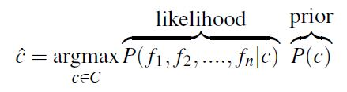
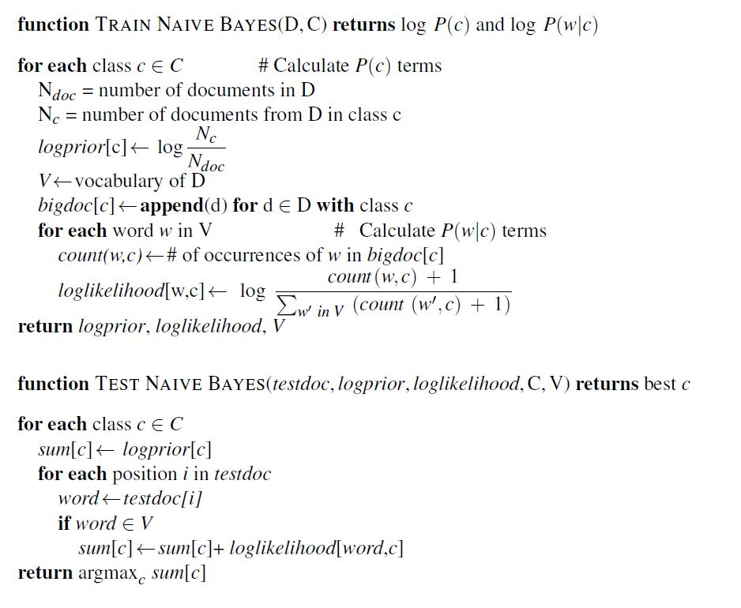

# Text Classification for Hate Speech
Hate speech is a  
(a) deliberate attack,  
(b) directed towards a specific group of people,  
(c) motivated by aspects of the group’s identity.  
The three premises must be true for a sentence to be categorized as HATE. Here are two examples:  
(a) “Poor white kids being forced to treat apes and parasites as their equals.”  
(b) “Islam is a false religion however unlike some other false religions it is crude and appeals to crude people such as arabs.”  
In (a), the speaker uses “apes” and “parasites” to refer to children of dark skin and implies they are not equal to “white kids”. That is, it is an attack to the group composed of children of dark skin based on an identifying characteristic, namely, their skin colour. Thus, all the premises are true and (a) is a valid example of HATE. Example (b) brands all people of Arab origin as crude. That is, it attacks the group composed of Arab people based on their origin. Thus, all the premises are true and (b) is a valid example of HATE.

The goal is to build a Naive Bayes model and a logistic regression model on a real-world hate speech classification dataset.The dataset used here is collected from Twitter online. Each example is labeled as 1 (hatespeech) or 0 (Non-hatespeech).  
  

## 1. Dataset Preperation
We start by dividing the data into train and test datasets.
```python
from sklearn.model_selection import train_test_split
train_frame, test_frame = train_test_split(train_frame, test_size=0.2)
```
* * *
## 2. Feature Engineering
In this step, raw text data will be transformed into feature vectors and new features will be created using the existing dataset.  
We represent a text document as if it were a bag-of-words, that is, an unordered set of words with their position ignored, keeping only their frequency in the document.

### Text Tokenization
First, we tokenize the text into tokens:
```python
tokenized_text = []
for i in range(0, len(train_frame['text'])):
   tokenized_text.append(tokenize(train_frame['text'][i]))
```
### Convert text into features
Then we convert the text into features. The example used here uses Unigram Features to convert the tokenized text into features. The first part creates the vocabulary.
```python
feat_extractor = UnigramFeature()
feat_extractor.fit(tokenized_text)
```
The next part shows the frequenct of each word in each document. (bag of words)
```python
X_train = feat_extractor.transform_list(tokenized_text)
Y_train = train_frame['label']
```
We tokenize and convert the test data into features, as well.
```python
tokenized_text = []
for i in range(0, len(test_frame['text'])):
    tokenized_text.append(tokenize(test_frame['text'][i]))
X_test = feat_extractor.transform_list(tokenized_text)
Y_test = test_frame['label']
```
* * *
## 3. Naive Bayes Model
Naive Bayes is a probabilistic classifier, meaning that for a document d, out of all classes C the classifier returns the class which has the maximum posterior probability given the document. We thus compute the most probable class given some document d by choosing the class which has the highest product of two probabilities: the prior probability of the class P(c) and the likelihood of the document P(d|c):

Without loss of generalization, we can represent a document d as a set of features f1,f2,...fn:

Naive Bayes is a classification technique based on Bayes’ Theorem with an assumption of independence among predictors. A Naive Bayes classifier assumes that the presence of a particular feature in a class is unrelated to the presence of any other feature. This is a very strong assumption that is most unlikely in real data, i.e. that the attributes do not interact:

The final equation for the class chosen by a naive Bayes classifier is thus:

To learn the probability P( fi|c), we’ll assume a feature is just the existence of a word in the document’s bag of words, and so we’ll want P(wi|c), which we compute as the fraction of times the word wi appears among all words in all documents of topic c.

But since naive Bayes naively multiplies all the feature likelihoods together, probabilities of zero will cause problems. So we use a technique called Laplace smoothing:

The Final algorithms is:

### Training the Naive Bayes Model
To learn the probability P( fijc), we’ll assume a feature is just the existence of a word in the document’s bag of words, and so we’ll want P(wijc), which we compute as the fraction of times the word wi appears among all words in all documents of topic c. We first concatenate all documents with category c into one big “category c” text. Then we use the frequency of wi in this concatenated document to give a maximum likelihood estimate of the probability:
#### Credits
This project is taken from Georgia Tech's NLP class, Fall 2020.
